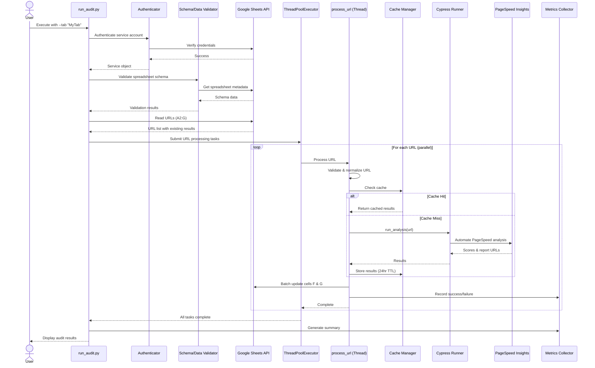
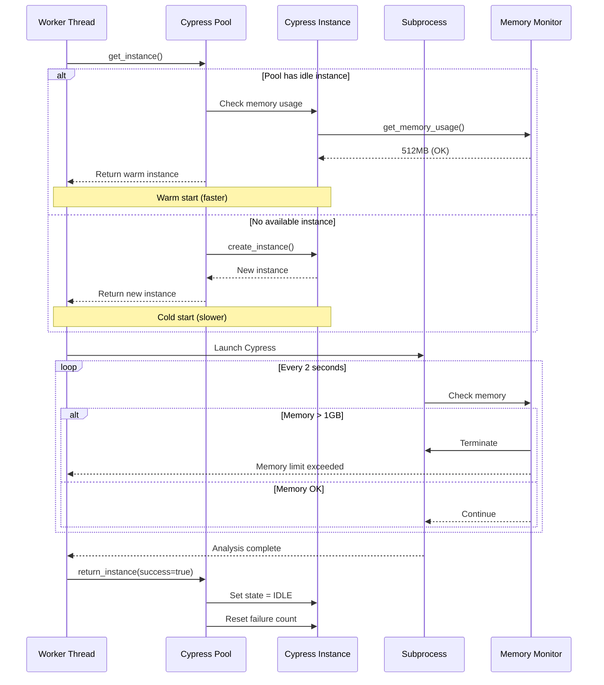
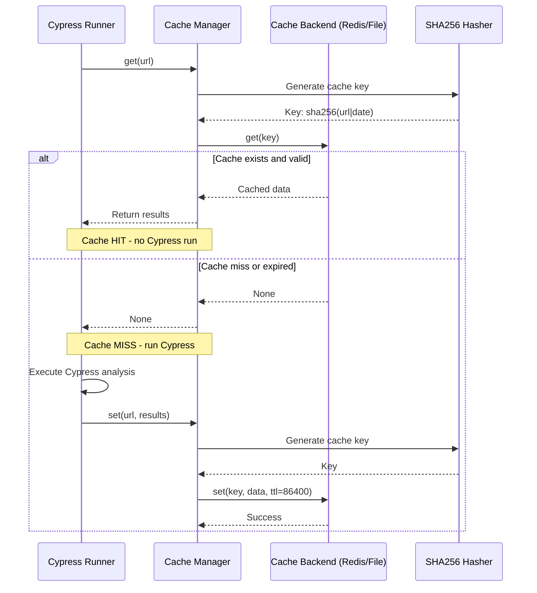
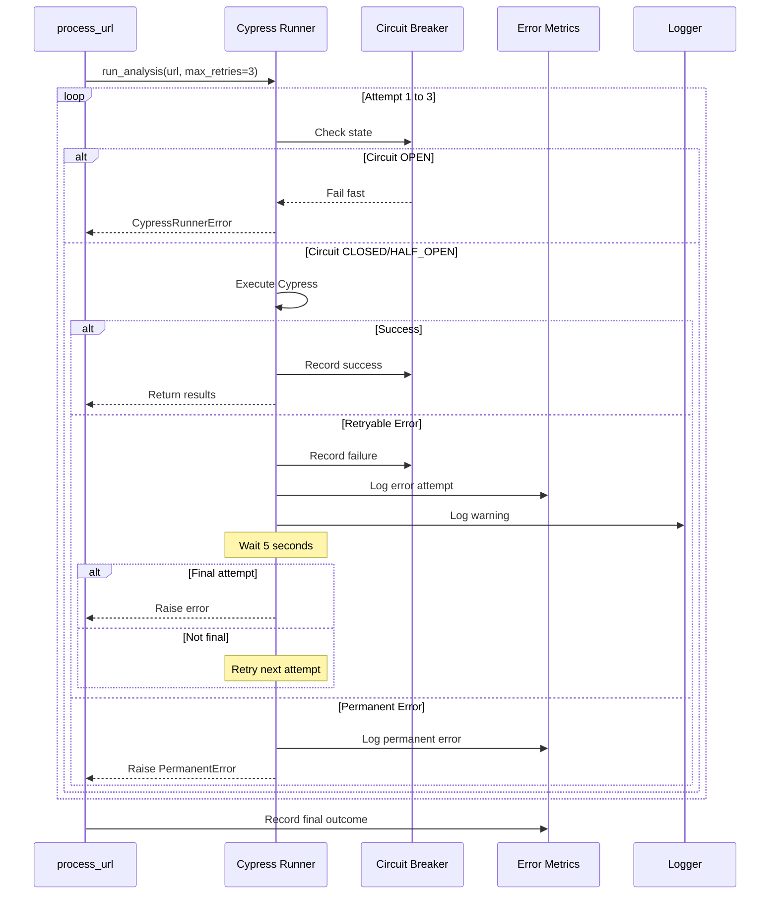

# Architecture Documentation

## Table of Contents
- [Overview](#overview)
- [System Components](#system-components)
- [Data Flow](#data-flow)
- [Sequence Diagrams](#sequence-diagrams)
- [Component Details](#component-details)
- [Design Patterns](#design-patterns)
- [Performance Optimizations](#performance-optimizations)
- [Scalability](#scalability)

## Overview

The PageSpeed Insights Audit Tool is a distributed system designed to automate the analysis of web page performance using Google's PageSpeed Insights service. The architecture follows a layered approach with clear separation of concerns.

### Architecture Layers

```
┌─────────────────────────────────────────────────────────┐
│                   CLI Interface Layer                   │
│              (run_audit.py, list_tabs.py)              │
└─────────────────────────────────────────────────────────┘
                            │
┌─────────────────────────────────────────────────────────┐
│                  Orchestration Layer                    │
│         (Thread Pool Executor, Signal Handlers)         │
└─────────────────────────────────────────────────────────┘
                            │
┌─────────────────────────────────────────────────────────┐
│                   Business Logic Layer                  │
│   ┌──────────────┐  ┌──────────────┐  ┌──────────────┐│
│   │   Validation │  │   Analysis   │  │   Results    ││
│   │   (URL/Data) │  │   (Cypress)  │  │  Processing  ││
│   └──────────────┘  └──────────────┘  └──────────────┘│
└─────────────────────────────────────────────────────────┘
                            │
┌─────────────────────────────────────────────────────────┐
│                   Infrastructure Layer                  │
│   ┌──────────┐  ┌──────────┐  ┌──────────┐  ┌────────┐│
│   │  Sheets  │  │  Cache   │  │ Security │  │Metrics ││
│   │   API    │  │ (Redis)  │  │  (Auth)  │  │(Prom)  ││
│   └──────────┘  └──────────┘  └──────────┘  └────────┘│
└─────────────────────────────────────────────────────────┘
                            │
┌─────────────────────────────────────────────────────────┐
│                    External Services                    │
│     Google Sheets API  │  PageSpeed Insights API       │
└─────────────────────────────────────────────────────────┘
```

## System Components

### 1. Entry Points

#### `run_audit.py`
- **Purpose**: Main orchestration script
- **Responsibilities**:
  - Command-line argument parsing
  - Authentication and service initialization
  - URL validation and preprocessing
  - Concurrent processing coordination
  - Results aggregation and reporting
- **Dependencies**: All core modules

#### `list_tabs.py`
- **Purpose**: Spreadsheet inspection utility
- **Responsibilities**: List available tabs in a spreadsheet
- **Usage**: Discovery and verification before audit runs

### 2. Core Modules

#### `tools/sheets/sheets_client.py`
- **Purpose**: Google Sheets API abstraction
- **Key Features**:
  - Service account authentication with connection pooling
  - Thread-safe read/write operations
  - Rate limiting (90 requests per 100 seconds)
  - Automatic retry with exponential backoff
  - Batch write optimization (100 cells per batch)

#### `tools/qa/cypress_runner.py`
- **Purpose**: Browser automation for PageSpeed Insights
- **Key Features**:
  - Cypress process management
  - Instance pooling for warm starts (up to 2 instances)
  - Memory monitoring (1GB threshold)
  - Progressive timeout strategy (300s → 600s)
  - Result streaming to avoid large file I/O
  - Circuit breaker pattern for service protection

#### `tools/cache/cache_manager.py`
- **Purpose**: Multi-backend caching system
- **Backends**:
  - **RedisBackend**: Production-ready with network resilience
  - **FileCacheBackend**: Development fallback with LRU eviction
- **Features**:
  - 24-hour TTL with automatic expiration
  - LRU eviction (max 1000 entries)
  - Thread-safe operations
  - Transparent fallback on Redis failure

#### `tools/metrics/metrics_collector.py`
- **Purpose**: Observability and monitoring
- **Metrics Collected**:
  - URL processing stats (success/failure/skipped)
  - Cache hit ratio
  - API quota usage
  - Processing time statistics
  - Failure reason categorization
- **Export Formats**:
  - Prometheus text format
  - JSON with timestamps
  - HTML dashboard via `generate_report.py`

### 3. Support Modules

#### `tools/utils/url_validator.py`
- URL format validation (regex-based)
- DNS resolution checking (with timeout)
- Redirect chain detection (max 3 redirects)
- URL normalization (case, slashes, query params)

#### `tools/security/`
- **service_account_validator.py**: Validate JSON structure and permissions
- **rate_limiter.py**: Per-spreadsheet rate limiting (60 req/min)
- **url_filter.py**: Whitelist/blacklist pattern matching
- **audit_trail.py**: JSONL-based modification logging

#### `tools/utils/error_metrics.py`
- Global error tracking
- Retry attempt counting
- Error categorization (retryable vs permanent)
- Thread-safe metrics aggregation

#### `tools/utils/circuit_breaker.py`
- Service protection pattern
- Failure threshold: 5 consecutive failures
- Recovery timeout: 300 seconds
- Automatic state transitions (CLOSED → OPEN → HALF_OPEN)

## Data Flow

### Standard Audit Flow

```
┌─────────────┐
│   User      │
│  Executes   │
│ run_audit   │
└──────┬──────┘
       │
       ▼
┌─────────────────────────────────────────────────────┐
│ 1. Authentication & Validation                      │
│    - Authenticate with Google Sheets                │
│    - Validate spreadsheet schema                    │
│    - Check data quality (duplicates, empty URLs)    │
└──────────────────────┬──────────────────────────────┘
                       │
                       ▼
┌─────────────────────────────────────────────────────┐
│ 2. Read URLs from Spreadsheet                       │
│    - Read columns A-G (single API call)             │
│    - Extract URLs from column A (starting row 2)    │
│    - Check existing results in columns F & G        │
│    - Identify skip conditions (passed/green BG)     │
└──────────────────────┬──────────────────────────────┘
                       │
                       ▼
┌─────────────────────────────────────────────────────┐
│ 3. Concurrent URL Processing (Thread Pool)          │
│    ┌──────────────────────────────────────────┐    │
│    │ For each URL (parallel, 1-5 workers):    │    │
│    │  a. URL validation (format/DNS/redirect) │    │
│    │  b. URL normalization                    │    │
│    │  c. Filter check (whitelist/blacklist)   │    │
│    │  d. Cache lookup (24hr TTL)              │    │
│    │  e. If cache miss → Cypress analysis     │    │
│    │  f. Parse results (mobile/desktop scores)│    │
│    │  g. Cache results                        │    │
│    │  h. Update spreadsheet immediately       │    │
│    └──────────────────────────────────────────┘    │
└──────────────────────┬──────────────────────────────┘
                       │
                       ▼
┌─────────────────────────────────────────────────────┐
│ 4. Results Aggregation & Reporting                  │
│    - Compile success/failure statistics             │
│    - Generate audit summary                         │
│    - Export metrics (JSON, Prometheus)              │
│    - Generate HTML dashboard (optional)             │
└─────────────────────────────────────────────────────┘
```

### Cypress Analysis Flow

```
┌──────────────┐
│ process_url  │
│  (Thread)    │
└──────┬───────┘
       │
       ▼
┌─────────────────────────────────┐
│ Cache Manager                   │
│  - Generate cache key (SHA256)  │
│  - Check Redis/File backend     │
└──────┬──────────────────┬───────┘
       │                  │
   Cache Hit          Cache Miss
       │                  │
       ▼                  ▼
┌──────────────┐   ┌────────────────────────────┐
│Return Cached │   │ Cypress Pool Manager       │
│   Results    │   │  - Get/create instance     │
└──────────────┘   │  - Check memory usage      │
                   │  - Progressive timeout     │
                   └────────┬───────────────────┘
                            │
                            ▼
                   ┌────────────────────────────┐
                   │ Launch Cypress Process     │
                   │  - Set CYPRESS_TEST_URL    │
                   │  - Run headless Chrome     │
                   │  - Monitor memory (2s poll)│
                   │  - Enforce timeout         │
                   └────────┬───────────────────┘
                            │
                            ▼
                   ┌────────────────────────────┐
                   │ Cypress Test Execution     │
                   │  (analyze-url.cy.js)       │
                   │  1. Visit PageSpeed.dev    │
                   │  2. Enter URL              │
                   │  3. Trigger analysis       │
                   │  4. Wait for results (120s)│
                   │  5. Extract mobile score   │
                   │  6. Switch to desktop view │
                   │  7. Extract desktop score  │
                   │  8. Save to JSON           │
                   └────────┬───────────────────┘
                            │
                            ▼
                   ┌────────────────────────────┐
                   │ Result Processing          │
                   │  - Stream JSON file        │
                   │  - Parse scores/URLs       │
                   │  - Cache results (24hr)    │
                   │  - Return to pool          │
                   └────────┬───────────────────┘
                            │
                            ▼
                   ┌────────────────────────────┐
                   │ Update Spreadsheet         │
                   │  - Batch write (chunks)    │
                   │  - Audit trail logging     │
                   │  - Rate limit enforcement  │
                   └────────────────────────────┘
```

## Sequence Diagrams

### 1. Complete Audit Sequence



### 2. Cypress Instance Pooling



### 3. Cache Lookup & Storage



### 4. Error Handling & Retry Flow



## Component Details

### Concurrency Model

The system uses a thread-based concurrency model with configurable parallelism (1-5 workers).

**Thread Safety Mechanisms:**
- `threading.Lock()` for shared state (processed count, logging)
- Connection pooling for Google Sheets service
- Thread-local Cypress instances in pool
- Atomic cache operations

**Synchronization Points:**
- URL processing coordination via `ThreadPoolExecutor`
- Spreadsheet write operations (sequential within each thread)
- Cache backend operations (backend-specific locking)
- Metrics collection (internal locking)

### State Management

**Global Singletons:**
- `_global_cache_manager`: Shared cache instance
- `_global_metrics_collector`: Shared metrics collector
- `_pool`: Shared Cypress instance pool
- `_circuit_breaker`: Shared circuit breaker for PSI
- `_service_cache`: Authenticated Google Sheets services

**Thread-Local State:**
- Each worker maintains its own processing context
- Cypress instances are assigned per-thread from pool
- Log messages are thread-safe via locking

### Error Recovery

**Retry Strategies:**
1. **Google Sheets API**: Exponential backoff (3 retries, 2s → 4s → 8s)
2. **Cypress Execution**: Fixed delay (3 retries, 5s wait)
3. **Circuit Breaker**: Automatic recovery after 300s timeout

**Error Categories:**
- **PermanentError**: No retry (404, 403, invalid URL)
- **RetryableError**: Retry with backoff (network, timeout)
- **CypressTimeoutError**: No retry but progressive timeout increase

## Design Patterns

### 1. **Singleton Pattern**
- Used for: Cache manager, metrics collector, circuit breaker
- Benefits: Shared state, memory efficiency

### 2. **Factory Pattern**
- Used for: Cache backend selection (Redis vs File)
- Benefits: Transparent fallback, testability

### 3. **Circuit Breaker Pattern**
- Used for: PageSpeed Insights service protection
- Benefits: Fail-fast, automatic recovery, service protection

### 4. **Object Pool Pattern**
- Used for: Cypress instance reuse
- Benefits: Warm starts, reduced overhead, memory control

### 5. **Strategy Pattern**
- Used for: Progressive timeout, cache backend selection
- Benefits: Runtime configuration, flexibility

### 6. **Observer Pattern**
- Used for: Metrics collection, audit trail
- Benefits: Decoupled monitoring, extensibility

## Performance Optimizations

### 1. **Instance Pooling**
- Reuse Cypress instances across URLs
- Warm starts reduce overhead by ~30%
- Memory monitoring prevents leaks

### 2. **Progressive Timeout**
- Start with 300s, increase to 600s on failure
- Balances speed and reliability
- Adapts to network conditions

### 3. **Incremental Updates**
- Write results immediately after each URL
- Users see progress in real-time
- Reduces memory footprint

### 4. **Batch Write Optimization**
- Chunk writes into groups of 100 cells
- Reduces API calls by ~95%
- Rate limiting prevents quota exhaustion

### 5. **Result Streaming**
- Stream JSON results instead of loading entirely
- Reduces memory usage for large files
- Faster parsing

### 6. **Connection Pooling**
- Cache authenticated Google Sheets services
- Avoid repeated authentication overhead
- Thread-safe access

### 7. **LRU Cache Eviction**
- Maintain max 1000 cache entries
- Automatic eviction of oldest items
- Prevents disk/memory bloat

### 8. **Memory Monitoring**
- Check Cypress memory every 2 seconds
- Auto-restart on >1GB usage
- Prevents system instability

## Scalability

### Vertical Scaling
- Increase `--concurrency` (1-5 workers)
- Higher values for machines with more CPU/RAM
- Limited by Google Sheets API quotas

### Horizontal Scaling
Not directly supported but can be achieved via:
- Split spreadsheet tabs across multiple machines
- Use shared Redis cache for coordination
- Aggregate metrics post-processing

### Bottlenecks
1. **Google Sheets API**: 90 requests/100s (rate limited)
2. **PageSpeed Insights**: Analysis time (~5-10 min per URL)
3. **Cypress Memory**: 1GB per instance (max 2 instances)

### Capacity Planning

**Single Worker:**
- ~6 URLs/hour (10 min/URL average)
- ~144 URLs/day (24hr continuous)

**5 Workers:**
- ~30 URLs/hour
- ~720 URLs/day (24hr continuous)

**Recommended Configuration:**
- **Small audits (<50 URLs)**: 1-2 workers
- **Medium audits (50-200 URLs)**: 3 workers
- **Large audits (200+ URLs)**: 5 workers with cache

### Resource Requirements

**Minimum:**
- 2 CPU cores
- 4GB RAM
- 1GB disk space

**Recommended:**
- 4+ CPU cores
- 8GB RAM
- 5GB disk space (for logs and cache)

**With Redis:**
- Additional 1GB RAM for Redis
- Redis on localhost or dedicated server
